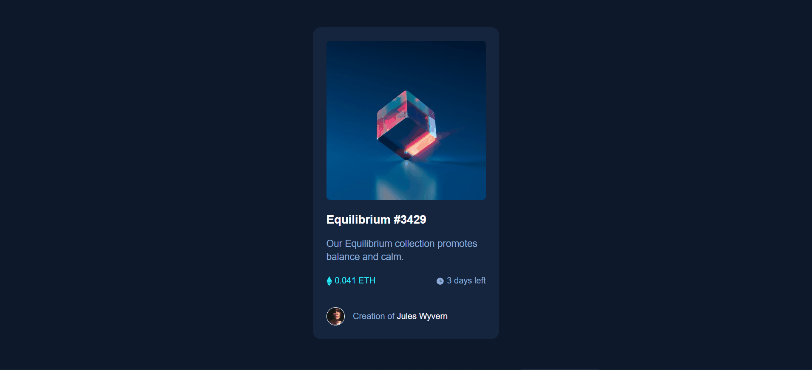

# Desafio NFT Card Component
Desafio feito do Frontend Mentor 💻🚀

## Linguagens utilizadas:
- HTML5
- CSS3

## Objetivo:
Criar um cartão de NFT utilizando HTML para criar a base do desafio e CSS para estilizar todo ele.

## Dificulades enfrentadas:
Na parte do HTML foi bem simples a criação do desafio utilizando o método de caixas, deixando claro o que cada parte iria conter.
No CSS a parte mais desafiadora foi a realização dos itens clicáveis e criação dos ícones antes do preço e os dias restantes.
